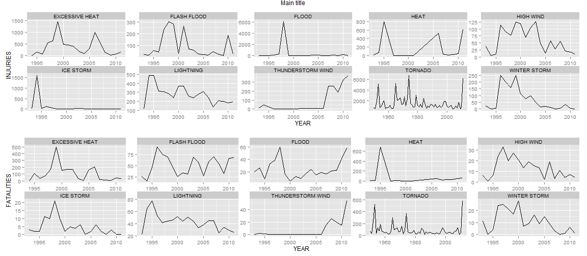
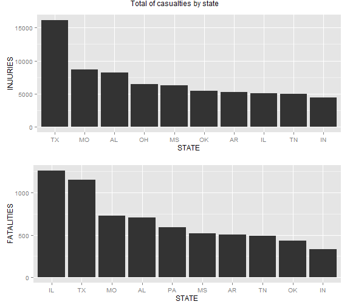
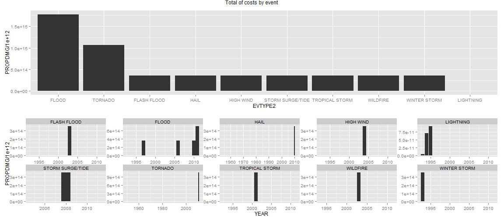

# Ttile

## Synopsis

Across the United States, which types of events (as indicated in the EVTYPE variable) are most harmful with respect to population health?  

Across the United States, which types of events have the greatest economic consequences?  

## Load and Processing the Data

Load the libraries for this analysis.

```r
library(ggplot2)
library(chron)
library(stringr)
library(lubridate)
```

```
## 
## Attaching package: 'lubridate'
## 
## The following objects are masked from 'package:chron':
## 
##     days, hours, minutes, seconds, years
```

```r
library(grid)
library(gridExtra)
library(devtools)
```

```
## WARNING: Rtools is required to build R packages, but is not currently installed.
## 
## Please download and install Rtools 3.1 from http://cran.r-project.org/bin/windows/Rtools/ and then run find_rtools().
## 
## Attaching package: 'devtools'
## 
## The following objects are masked from 'package:utils':
## 
##     ?, help
## 
## The following object is masked from 'package:base':
## 
##     system.file
```

```r
library(plotflow)
```

Verify if dataset exists.

```r
if(!file.exists("./storm.csv.bz2")){
    val<-download.file("http://d396qusza40orc.cloudfront.net/repdata%2Fdata%2FStormData.csv.bz2",
                  "storm.csv.bz2")
    print(val)
    if(val != 0){
        stop("Failure on download of the file")
    }
}
```

Download Documentation.

```r
if(!file.exists("./stormDoc.pdf")){
    download.file("http://d396qusza40orc.cloudfront.net/repdata%2Fpeer2_doc%2Fpd01016005curr.pdf",
                  "stormDoc.pdf")
}
if(!file.exists("./faqDoc.pdf")){
    download.file("http://d396qusza40orc.cloudfront.net/repdata%2Fpeer2_doc%2FNCDC%20Storm%20Events-FAQ%20Page.pdf", "faqDoc.pdf")
}
```

Unpack and Read the dataset.

```r
if(file.exists("./storm.csv.bz2")){
    stormData<-read.csv(bzfile("./storm.csv.bz2"), na.strings=c("", "?"))    
}else{
    stop("The dataset not exists")
}
```


Formatting names and trim the rows values in the dataset.

```r
#Set the names for the R standard
names(stormData)<- make.names(names(stormData), allow_=F)

#removing space values
for(i in 1:dim(stormData)[2]){
    stormData[,i]<-str_trim(stormData[,i])
}
```

After read, we check the first few rows (there are 902,297 rows) in this dataset.

```r
dim(stormData)
```

```
## [1] 902297     37
```

```r
head(stormData)
```

```
##   STATE..           BGN.DATE BGN.TIME TIME.ZONE COUNTY COUNTYNAME STATE
## 1       1  4/18/1950 0:00:00     0130       CST     97     MOBILE    AL
## 2       1  4/18/1950 0:00:00     0145       CST      3    BALDWIN    AL
## 3       1  2/20/1951 0:00:00     1600       CST     57    FAYETTE    AL
## 4       1   6/8/1951 0:00:00     0900       CST     89    MADISON    AL
## 5       1 11/15/1951 0:00:00     1500       CST     43    CULLMAN    AL
## 6       1 11/15/1951 0:00:00     2000       CST     77 LAUDERDALE    AL
##    EVTYPE BGN.RANGE BGN.AZI BGN.LOCATI END.DATE END.TIME COUNTY.END
## 1 TORNADO         0    <NA>       <NA>     <NA>     <NA>          0
## 2 TORNADO         0    <NA>       <NA>     <NA>     <NA>          0
## 3 TORNADO         0    <NA>       <NA>     <NA>     <NA>          0
## 4 TORNADO         0    <NA>       <NA>     <NA>     <NA>          0
## 5 TORNADO         0    <NA>       <NA>     <NA>     <NA>          0
## 6 TORNADO         0    <NA>       <NA>     <NA>     <NA>          0
##   COUNTYENDN END.RANGE END.AZI END.LOCATI LENGTH WIDTH F MAG FATALITIES
## 1       <NA>         0    <NA>       <NA>     14   100 3   0          0
## 2       <NA>         0    <NA>       <NA>      2   150 2   0          0
## 3       <NA>         0    <NA>       <NA>    0.1   123 2   0          0
## 4       <NA>         0    <NA>       <NA>      0   100 2   0          0
## 5       <NA>         0    <NA>       <NA>      0   150 2   0          0
## 6       <NA>         0    <NA>       <NA>    1.5   177 2   0          0
##   INJURIES PROPDMG PROPDMGEXP CROPDMG CROPDMGEXP  WFO STATEOFFIC ZONENAMES
## 1       15      25          K       0       <NA> <NA>       <NA>      <NA>
## 2        0     2.5          K       0       <NA> <NA>       <NA>      <NA>
## 3        2      25          K       0       <NA> <NA>       <NA>      <NA>
## 4        2     2.5          K       0       <NA> <NA>       <NA>      <NA>
## 5        2     2.5          K       0       <NA> <NA>       <NA>      <NA>
## 6        6     2.5          K       0       <NA> <NA>       <NA>      <NA>
##   LATITUDE LONGITUDE LATITUDE.E LONGITUDE. REMARKS REFNUM
## 1     3040      8812       3051       8806    <NA>      1
## 2     3042      8755          0          0    <NA>      2
## 3     3340      8742          0          0    <NA>      3
## 4     3458      8626          0          0    <NA>      4
## 5     3412      8642          0          0    <NA>      5
## 6     3450      8748          0          0    <NA>      6
```

The column we are interested in is the EVTYPE. Here we print the quantity of unique values and NA's.

```r
print(length(unique(stormData$EVTYPE)))
```

```
## [1] 977
```

```r
print(length(which(is.na(stormData$EVTYPE))))
```

```
## [1] 1
```

Set the values from EVTYPE, PROPDMGEXP and CROPDMGEXP columns to upper-case.  Here we print the quantity of unique values in EVTYPE comlumn

```r
stormData$EVTYPE<-toupper(stormData$EVTYPE)
stormData$PROPDMGEXP<-toupper(stormData$PROPDMGEXP)
stormData$CROPDMGEXP<-toupper(stormData$CROPDMGEXP)

print(length(unique(stormData$EVTYPE)))
```

```
## [1] 890
```

Filtering the accepted values. Here we print the quantity, unique and excluded values

```r
allowEvents<-c("Astronomical Low Tide", "Avalanche", "Blizzard", "Coastal Flood", "Cold/Wind Chill",
               "Debris Flow", "Dense Fog", "Dense Smoke", "Drought", "Dust Devil", "Dust Storm",
               "Excessive Heat", "Extreme Cold/Wind Chill", "Flash Flood", "Flood", "Frost/Freeze",
               "Funnel Cloud", "Freezing Fog", "Hail", "Heat", "Heavy Rain", "Heavy Snow", "High Surf",
               "High Wind", "Hurricane (Typhoon)", "Ice Storm", "Lake-Effect Snow", "Lakeshore Flood",
               "Lightning", "Marine Hail", "Marine High Wind", "Marine Strong Wind", "Marine Thunderstorm Wind",
               "Rip Current", "Seiche", "Sleet", "Storm Surge/Tide", "Strong Wind", "Thunderstorm Wind",
               "Tornado", "Tropical Depression", "Tropical Storm", "Tsunami", "Volcanic Ash", "Waterspout",
               "Wildfire", "Winter Storm", "Winter Weather")

allowExp<-c("K", "M", "B")

allowEvents<-toupper(allowEvents)
#print(length(unique(allowEvents)))

allowValues<-stormData$EVTYPE[stormData$EVTYPE %in% allowEvents]

print(length(unique(allowValues)))
```

```
## [1] 46
```

```r
print(unique(allowValues))
```

```
##  [1] "TORNADO"                  "HAIL"                    
##  [3] "WINTER STORM"             "HEAVY RAIN"              
##  [5] "LIGHTNING"                "THUNDERSTORM WIND"       
##  [7] "DENSE FOG"                "RIP CURRENT"             
##  [9] "FLASH FLOOD"              "FUNNEL CLOUD"            
## [11] "HEAT"                     "FLOOD"                   
## [13] "WATERSPOUT"               "HIGH WIND"               
## [15] "BLIZZARD"                 "HEAVY SNOW"              
## [17] "COASTAL FLOOD"            "ICE STORM"               
## [19] "AVALANCHE"                "DUST STORM"              
## [21] "SLEET"                    "DUST DEVIL"              
## [23] "EXCESSIVE HEAT"           "HIGH SURF"               
## [25] "STRONG WIND"              "WINTER WEATHER"          
## [27] "DROUGHT"                  "TROPICAL STORM"          
## [29] "WILDFIRE"                 "LAKE-EFFECT SNOW"        
## [31] "FREEZING FOG"             "VOLCANIC ASH"            
## [33] "FROST/FREEZE"             "SEICHE"                  
## [35] "TROPICAL DEPRESSION"      "EXTREME COLD/WIND CHILL" 
## [37] "MARINE HAIL"              "STORM SURGE/TIDE"        
## [39] "COLD/WIND CHILL"          "MARINE HIGH WIND"        
## [41] "TSUNAMI"                  "DENSE SMOKE"             
## [43] "LAKESHORE FLOOD"          "MARINE THUNDERSTORM WIND"
## [45] "MARINE STRONG WIND"       "ASTRONOMICAL LOW TIDE"
```

```r
print(allowEvents[ ! (allowEvents %in% allowValues) ])
```

```
## [1] "DEBRIS FLOW"         "HURRICANE (TYPHOON)"
```

As can be seen, some of the values are not acceptable (view the instruction service document from NOOA, pg 17, cap 2.1). So, here the acceptable values will be set, and the unacceptable values will be coerced to NA value.


```r
#Set the EVTYPE coerced values
stormData$EVTYPE2<-factor(stormData$EVTYPE, labels=allowEvents, levels=allowEvents)

print(length(which(is.na(stormData$EVTYPE2))))
```

```
## [1] 266942
```

```r
#Set the STATE as factor
stormData$STATE<-factor(stormData$STATE)

#Set the PROPDMGEXP and CROPDMGEXP coerced values
stormData$PROPDMGEXP<-factor(toupper(stormData$PROPDMGEXP), labels=allowExp, levels=allowExp)
stormData$CROPDMGEXP<-factor(toupper(stormData$CROPDMGEXP), labels=allowExp, levels=allowExp)

#Convert to numeric
stormData$PROPDMG<-as.numeric(stormData$PROPDMG)
stormData$CROPDMG<-as.numeric(stormData$CROPDMG)
stormData$INJURIES<-as.numeric(stormData$INJURIES)
stormData$FATALITIES<-as.numeric(stormData$FATALITIES)


#Set the real values from PROPDMG and CROPDMG columns, based in the PROPDMGEXP and CROPDMGEXP columns, respectively.
stormData$PROPDMG[stormData$PROPDMGEXP == "K"] <- prod(stormData$PROPDMG[stormData$PROPDMGEXP == "K"], 1e+03, na.rm=T)
stormData$PROPDMG[stormData$PROPDMGEXP == "M"] <- prod(stormData$PROPDMG[stormData$PROPDMGEXP == "M"], 1e+06, na.rm=T)
stormData$PROPDMG[stormData$PROPDMGEXP == "B"] <- prod(stormData$PROPDMG[stormData$PROPDMGEXP == "B"], 1e+09, na.rm=T)

stormData$CROPDMG[stormData$CROPDMGEXP == "K"] <- prod(stormData$CROPDMG[stormData$CROPDMGEXP == "K"], 1e+03, na.rm=T)
stormData$CROPDMG[stormData$CROPDMGEXP == "M"] <- prod(stormData$CROPDMG[stormData$CROPDMGEXP == "M"], 1e+06, na.rm=T)
stormData$CROPDMG[stormData$CROPDMGEXP == "B"] <- prod(stormData$CROPDMG[stormData$CROPDMGEXP == "B"], 1e+09, na.rm=T)
```

Grouping the data by event type

```r
deathst<-aggregate(FATALITIES~EVTYPE2, FUN=sum, data=stormData)
injuriesst<-aggregate(INJURIES~EVTYPE2, FUN=sum, data=stormData)
bothst <- merge(deathst, injuriesst, id = "EVTYPE2")

#casualty calc
stsum<-aggregate(cbind(TOTALS=INJURIES+FATALITIES, deparse.level = 2 )~EVTYPE2, 
                 FUN=sum, data=stormData)

attach(stsum)
orderst <- stsum[order(-TOTALS), ]
detach(stsum)

st10<-as.data.frame(orderst[1:10, "EVTYPE2"])
names(st10)[1]<-"EVTYPE"

top10st<-stormData[stormData$EVTYPE2 %in% st10$EVTYPE, ]
head(top10st)
```

```
##   STATE..           BGN.DATE BGN.TIME TIME.ZONE COUNTY COUNTYNAME STATE
## 1       1  4/18/1950 0:00:00     0130       CST     97     MOBILE    AL
## 2       1  4/18/1950 0:00:00     0145       CST      3    BALDWIN    AL
## 3       1  2/20/1951 0:00:00     1600       CST     57    FAYETTE    AL
## 4       1   6/8/1951 0:00:00     0900       CST     89    MADISON    AL
## 5       1 11/15/1951 0:00:00     1500       CST     43    CULLMAN    AL
## 6       1 11/15/1951 0:00:00     2000       CST     77 LAUDERDALE    AL
##    EVTYPE BGN.RANGE BGN.AZI BGN.LOCATI END.DATE END.TIME COUNTY.END
## 1 TORNADO         0    <NA>       <NA>     <NA>     <NA>          0
## 2 TORNADO         0    <NA>       <NA>     <NA>     <NA>          0
## 3 TORNADO         0    <NA>       <NA>     <NA>     <NA>          0
## 4 TORNADO         0    <NA>       <NA>     <NA>     <NA>          0
## 5 TORNADO         0    <NA>       <NA>     <NA>     <NA>          0
## 6 TORNADO         0    <NA>       <NA>     <NA>     <NA>          0
##   COUNTYENDN END.RANGE END.AZI END.LOCATI LENGTH WIDTH F MAG FATALITIES
## 1       <NA>         0    <NA>       <NA>     14   100 3   0          0
## 2       <NA>         0    <NA>       <NA>      2   150 2   0          0
## 3       <NA>         0    <NA>       <NA>    0.1   123 2   0          0
## 4       <NA>         0    <NA>       <NA>      0   100 2   0          0
## 5       <NA>         0    <NA>       <NA>      0   150 2   0          0
## 6       <NA>         0    <NA>       <NA>    1.5   177 2   0          0
##   INJURIES PROPDMG PROPDMGEXP CROPDMG CROPDMGEXP  WFO STATEOFFIC ZONENAMES
## 1       15       0          K       0       <NA> <NA>       <NA>      <NA>
## 2        0       0          K       0       <NA> <NA>       <NA>      <NA>
## 3        2       0          K       0       <NA> <NA>       <NA>      <NA>
## 4        2       0          K       0       <NA> <NA>       <NA>      <NA>
## 5        2       0          K       0       <NA> <NA>       <NA>      <NA>
## 6        6       0          K       0       <NA> <NA>       <NA>      <NA>
##   LATITUDE LONGITUDE LATITUDE.E LONGITUDE. REMARKS REFNUM EVTYPE2
## 1     3040      8812       3051       8806    <NA>      1 TORNADO
## 2     3042      8755          0          0    <NA>      2 TORNADO
## 3     3340      8742          0          0    <NA>      3 TORNADO
## 4     3458      8626          0          0    <NA>      4 TORNADO
## 5     3412      8642          0          0    <NA>      5 TORNADO
## 6     3450      8748          0          0    <NA>      6 TORNADO
```

```r
YEAR<-with(top10st, year(as.Date(as.character(BGN.DATE), format="%m/%d/%Y")))
```

```
## Warning: unable to identify current timezone 'H':
## please set environment variable 'TZ'
## Warning: unknown timezone 'localtime'
```

```r
stsum<-aggregate(cbind(INJURIES, FATALITIES, PROPDMG, CROPDMG, deparse.level = 2 )~EVTYPE2+YEAR+STATE, 
                 FUN=sum, data=top10st)

statesum<-aggregate(cbind(INJURIES, FATALITIES, PROPDMG, CROPDMG, deparse.level = 2 )~STATE, 
                 FUN=sum, data=stsum)

#Costs calc
stcostsum<-aggregate(cbind(TOTALS=PROPDMG+CROPDMG, deparse.level = 2 )~EVTYPE2, 
                 FUN=sum, data=stormData)

attach(stcostsum)
orderst <- stcostsum[order(-TOTALS), ]
detach(stcostsum)

st10c<-as.data.frame(orderst[1:10, "EVTYPE2"])
names(st10c)[1]<-"EVTYPE"

top10stc<-stormData[stormData$EVTYPE2 %in% st10c$EVTYPE, ]
YEAR<-with(top10stc, year(as.Date(as.character(BGN.DATE), format="%m/%d/%Y")))

stcostsum<-aggregate(cbind(PROPDMG, CROPDMG, deparse.level = 2 )~EVTYPE2+YEAR, 
                 FUN=sum, data=top10stc)

eventcostsum<-aggregate(cbind(PROPDMG, CROPDMG, deparse.level = 2 )~EVTYPE2, 
                 FUN=sum, data=top10stc)
```


```r
#head(stsum)
#teste<-reorder_by(STATE, ~-INJURIES, data=statesum, sum)
#head(teste)
#statesum<-statesum[with(statesum, order(EVTYPE2, -INJURIES)), ]
#head(statesum)
```


## Results

XXXXXXXX

```r
plot1<-qplot(YEAR, INJURIES, geom="line", data=stsum, stat="summary", fun.y = "sum")
plot1<-plot1+facet_wrap(~EVTYPE2, nrow=2, scales="free")

plot2<-qplot(YEAR, FATALITIES, geom="line", data=stsum, stat="summary", fun.y = "sum")
plot2<-plot2+facet_wrap(~EVTYPE2, nrow=2, scales="free")

grid.arrange(plot1, plot2, nrow = 2, main = "Main title")
```



XXXXXX


```r
statesum$STATE<-factor(statesum$STATE, levels=unique(statesum$STATE[order(-statesum$INJURIES)]))
temp<-statesum[order(-statesum$INJURIES), ]
top10<-temp[1:10,]
plot1<-ggplot( top10, aes(x=STATE, y=INJURIES))+
    geom_bar(stat = "identity")

statesum$STATE<-factor(statesum$STATE, levels=unique(statesum$STATE[order(-statesum$FATALITIES)]))
temp<-statesum[order(-statesum$FATALITIES), ]
top10<-temp[1:10,]
plot2<-ggplot( top10, aes(x=STATE, y=FATALITIES))+
    geom_bar(stat = "identity")

grid.arrange(plot1, plot2, nrow = 2, main = "Total of casualties by state" )
```



XXXXXX


```r
eventcostsum$EVTYPE2<-factor(eventcostsum$EVTYPE2, levels=unique(eventcostsum$EVTYPE2[order(-eventcostsum$PROPDMG)]))
temp<-eventcostsum[order(-eventcostsum$PROPDMG), ]
top10<-temp[1:10,]

plot1<-ggplot( top10, aes(x=EVTYPE2, y=PROPDMG/1e+12))+
    geom_bar(stat = "identity")


plot2<-qplot(YEAR, PROPDMG/1e+12, geom="bar", data=stcostsum, stat="summary", fun.y = "sum")
plot2<-plot2+facet_wrap(~EVTYPE2, nrow=2, scales="free")

grid.arrange(plot1, plot2, nrow = 2, main = "Total of costs by event" )
```




## Conclusion

XXXXXXXXXX
